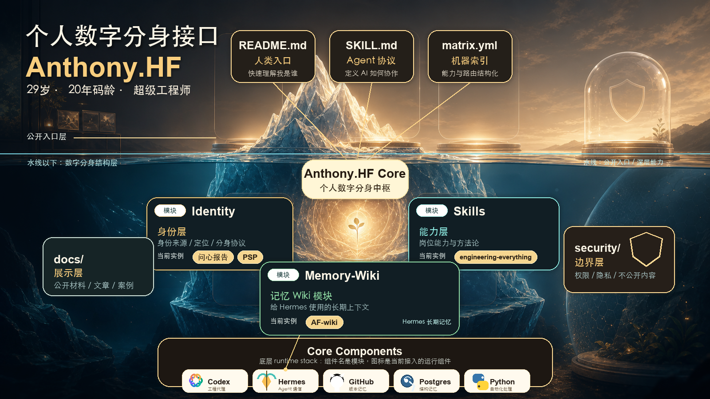

# AnthonyHF.Skill



> AnthonyHF.Skill 是 Anthony Fan 的个人数字分身接口：把“我是谁、我会做什么、我经历过什么、哪些不能公开”组织成 AI 可以读取、普通人也能看懂的仓库。

[](https://opensource.org/licenses/MIT)
[](identity/psp/anthony-fan/PSP.md)
[](skills/engineering-everything/engineering-everything/SKILL.md)

[我是谁](#我是谁) · [数字分身结构](#数字分身结构) · [如何使用](#如何使用) · [仓库结构](#仓库结构) · [公开边界](#公开边界)

---

## 我是谁

**我是 Anthony Fan，29 岁，20 年码龄的超级工程师。**

问心报告给我的公开定位是：连续创业的全栈 CTO，一个用长期学习纪律和底层工程肌肉反复穿过技术浪潮的人。我的路径不是简单换赛道，而是不断“下到下一层”：从 9 岁被攻击脚本吸引，到 C++、UIUC ECE、NVIDIA Tegra SoC simulation，再到企业级电商 BI、数据治理、LLM/Agent 和 AI 落地创业。

这不是一个“会写代码的人”的简历。更准确地说，这是一个把学习、工程、业务场景和创业判断持续叠加的人。

如果只用三个关键词理解我：**底层穿透、业务闭环、长期复利**。

当前公开主线：

- **连续创业 CTO**：从 GrainedAI 的 GUI agent trajectory 数据供应商，到 MetaInflow 的企业级 AI 落地。
- **底层穿透型工程师**：从软硬交界处建立元认知，再向上穿透到数据、业务和 AI 应用。
- **企业 AI 落地者**：服务过欧莱雅、利洁时等 tier 1 客户，经历 RPA、数据中台、BERT、LLM 到 Agent 的演进。
- **长期学习的苦行僧**：6 年坚持工作日 2-3 小时加周末定向学习，形成可验证的跨域复利。
- **正在升级的系统构建者**：下一阶段重点不是再证明会工程，而是把工程能力产品化、组织化、商业化。

会议里的我更接近一个把抽象能力压到现实闭环的人：会追任务表、时间线、风险、owner、客户资料、验收标准、交付链路和现金流；会讲 context、memory、workflow、graph、ontology，也会问第一步抓手是什么、怎么低成本验证、怎么灰度、公测、宣发和转化。

所以 AnthonyHF.Skill 不是“个人介绍页”，而是一个正在形成的个人操作系统入口：身份、能力、记忆和边界都要能被人读懂，也要能被 Agent 正确调用。

## 问心报告的公开画像

本仓库不把 Anthony 压成一个标准 CTO 标签。更接近的画像是一组组合能力：

| 维度 | 当前画像 |
| --- | --- |
| 核心身份 | 29 岁、20 年码龄、连续创业 CTO、超级工程师 |
| 最强壁垒 | 可验证的长期学习纪律和跨域学习复利 |
| 工程底座 | C/C++、ECE、NVIDIA SoC、软硬交界元认知、全栈工程 |
| 业务战场 | 电商 BI、数据治理、企业级 AI 落地、LLM/Agent workflow |
| 浪潮判断 | 从 BERT 到 LLM，从 GUI agent trajectory 到企业 AI 落地 |
| 工作方式 | 把抽象判断压到任务表、链路、节点、标准、owner 和验证 |
| AI 判断 | 不信 prompt-only，关注 context、memory、workflow、ontology、长期迭代 |
| 真实短板 | 产品化、商业转化、组织复制仍是下一阶段要补的能力 |

问心报告把 Anthony 的主线总结为：**用纪律性换跨域学习的复利，用复利换创业资本**。这个 README 采用的是公开展示版，不展示不适合公开仓库承载的私人诊断。

来源：

- [问心报告：连续创业的苦行僧](identity/wenxin/wenxin-report-continuous-founder-ascetic.pdf)
- [问心 Skill](https://github.com/HaodiFan/wenxin-skill)：生成对外定位、履历叙事和个人 BP 材料的 Skill；它不是本仓库的 submodule。
- [PSP · Anthony Fan](identity/psp/anthony-fan/PSP.md)：PSP 方法的产出物，负责描述数字分身的判断方式、置信度和行为边界；v0.3 已吸收 Feishu 妙记的私有蒸馏结论，但不公开原始会议内容。

## 数字分身结构

普通人可以把这个 repo 理解成一个人的“数字工作台”：

| 层 | 像什么 | 当前模块/实例 |
| --- | --- | --- |
| `identity/` 身份层 | 身份证、公开履历、自我模型 | 问心报告、PSP、公开身份配置 |
| `skills/` 能力层 | 会做事的方法和工具 | `engineering-everything` 是 CTO 岗工程 Skill，未来会有更多认知/运营 Skill |
| `memory/` 记忆层 | 长期笔记本和工作生活上下文 | `Memory-Wiki` 是模块名，当前实例是 `AF-wiki`，给 Hermes 作为长期记忆使用 |
| `docs/` 展示层 | 对外说明书、图、文章、案例 | README 封面图和结构说明 |
| `security/` 边界层 | 什么能公开、什么必须隔离 | 权限、隐私、不可公开内容规则 |

这里要区分“模块名”和“当前实例”：

| 模块名 | 当前 AnthonyHF 里的实例 | 含义 |
| --- | --- | --- |
| Identity | 问心报告 + PSP + public-profile | 我是谁，以及 AI 如何理解这个人 |
| Skills | Engineering Everything | 我能做什么；Engineering Everything 只是第一个具体 Skill |
| Memory-Wiki | AF-wiki | 我经历过什么、当前在做什么、长期记忆在哪里 |

## 如何使用

### 给人类读者

从上往下读 README：先认识 Anthony，再理解这个 repo 如何承载数字分身。如果只想看履历和定位，读 [问心报告](identity/wenxin/wenxin-report-continuous-founder-ascetic.pdf)。如果想理解 AI 如何协作，读 [SKILL.md](SKILL.md)。

### 给 AI Agent

先读 [SKILL.md](SKILL.md)，再按任务路由：

- 问“Anthony 是谁”：读 `identity/wenxin/` 和 `identity/psp/`。
- 问工程、架构、项目执行、SOP、review：读 `skills/engineering-everything/`。
- 问当前工作、生活、项目、复盘、知识库：读 `memory/af-wiki/`。
- 问能不能公开、能不能提交、能不能复制：读 `security/`。

### 克隆仓库

```bash
# 克隆仓库并包含所有子模块
git clone --recurse-submodules https://github.com/HaodiFan/AnthonyHF.Skill.git

# 已有本地仓库时，初始化子模块
git submodule update --init --recursive
```

## 效果示例

> **Q: 请用一句话介绍 Anthony Fan。**
>
> **AnthonyHF.Skill**: Anthony Fan 是 29 岁、20 年码龄的连续创业 CTO，从底层软硬交界一路穿透到企业 AI 落地，用长期学习纪律、工程深度和浪潮判断构建自己的第二次创业复利。

> **Q: 我想给一个旧项目加新功能，应该从哪开始？**
>
> **AnthonyHF.Skill**: 先不要写代码。按 Engineering Everything 的路由，先确认项目真相源、现有架构、边界、验证门禁和最小端到端闭环；如果涉及 Anthony 当前工作上下文，再进入 AF-wiki 找项目记忆。

## 仓库结构

```text
AnthonyHF.Skill/
├── identity/          # 身份层：我是谁，别人如何理解我，AI 如何描述我
│   ├── public-profile/ # 可公开身份配置，不放账号密码
│   ├── wenxin/         # 问心 Skill 的产出物：对外定位、履历、BP 材料
│   └── psp/            # PSP 方法的产出物：分身内核、判断方式、边界
├── skills/            # 能力层：数字分身能替 Anthony 做什么
│   └── engineering-everything/ # CTO 岗工程判断与执行 Skill
├── memory/            # 记忆层：工作、生活、知识、项目和复盘
│   └── af-wiki/        # AF-wiki submodule，Hermes 的长期记忆源
├── docs/              # 展示层：结构图、说明文档、公开材料
├── security/          # 边界层：隐私、权限、不可公开内容
├── SKILL.md           # Agent 协议：AI 如何读取和协作
└── matrix.yml         # 机器索引：能力与路由结构化清单
```

## 公开边界

这个仓库是公开入口，不是 Anthony 的全部私人数据。

- 不提交 API Key、Token、密码、cookie、私钥、证件、合同、聊天记录。
- 不把 AF-wiki 内容复制到根仓库；AF-wiki 是长期记忆真相源。
- 不把 Wenxin Skill 放进 submodule；本仓库只保留它产出的公开身份材料。
- 不编造 Anthony 的经历、客户、能力水位或私人心理画像。
- 不把 PSP scaffold 当成完整真人复刻；低置信度内容必须标注。

## 开发者与协议

- **Owner**: Anthony Fan
- **License**: [MIT](LICENSE)
- **Built with**: Codex, Wenxin Skill output, PSP v0.3 scaffold, Feishu Miaoji distilled evidence, Engineering Everything Skill
