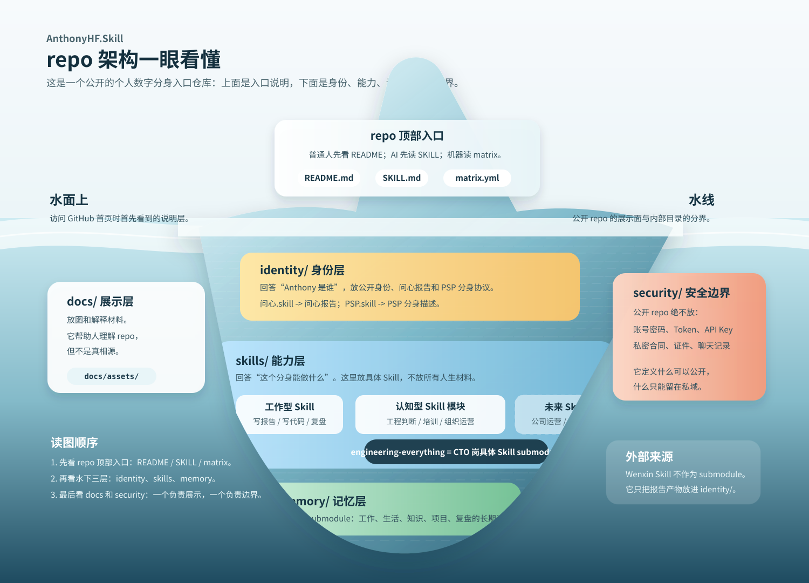

# AnthonyHF.Skill



这是 Anthony Fan 的个人数字分身入口。

它不是一个普通代码仓库，也不是简历仓库。你可以把它理解成：一个 AI 想要“像 Anthony 一样做事”时，先从这里进门，再去读取不同层面的材料。

这个仓库主要回答三件事：

1. Anthony 是谁。
2. Anthony 的数字分身由哪些部分组成。
3. AI 或人应该怎么使用这些材料。

## Anthony 是谁

**29 岁，20 年码龄的超级工程师。**

Anthony Fan 的主线不是“会写代码的人”，而是一个长期把技术、学习、创业和现实交付压进同一条轨道里的人：从早年编程和底层技术兴趣开始，到 NVIDIA 硬件相关经历，再到企业级 AI 落地、数据基础设施和连续创业。

这份定位来自 [问心 Skill](https://github.com/HaodiFan/wenxin-skill) 的人物定位产出。完整产出物见：[问心报告：连续创业的苦行僧](identity/wenxin/wenxin-report-continuous-founder-ascetic.pdf)。

### 问心报告给出的对外定位

> 29 岁 20 年码龄的连续创业 CTO / 超级工程师。

更展开地说：

- **他是谁**：从底层硬件经验走向企业级 AI 落地的连续创业 CTO，长期在“硬技术、真实业务、AI 浪潮变化”交界处工作。
- **他凭什么**：底层穿透能力 + 多年定向学习形成的跨域复利；有企业级客户交付经验，也经历过数据创业和 AI 落地创业。
- **他能给什么**：从底层成本结构到业务交付的完整技术判断力，以及对 AI 落地机会窗口的敏感度。

问心报告里最值得被公开展示的判断是：

- **最强壁垒**：长期、可验证、可复利的学习习惯。
- **第二壁垒**：企业级电商 / BI / AI 落地的真实生产经验。
- **第三壁垒**：在 GUI agent trajectory 数据窗口期的市场判断。
- **第四壁垒**：软硬交界处的元认知地图，知道自己知道什么，也知道自己不知道什么。

## 这个仓库是什么

AnthonyHF.Skill 是一个总入口。

它本身不保存所有东西，而是负责告诉 AI：

- 哪些东西代表 Anthony 的身份。
- 哪些 Skill 能替 Anthony 做事。
- 哪些知识库记录 Anthony 的工作和生活。
- 哪些内容可以公开，哪些内容绝不能放进公开仓库。

## Repo 架构冰山图

README 顶部那张图是这个仓库的第一入口。它的作用不是做技术系统图，而是让普通人一眼看懂 AnthonyHF.Skill 这个公开 repo 的组织方式：

- 水面上是 GitHub 首页最先看到的入口文件：`README.md`、`SKILL.md`、`matrix.yml`。
- 水面下是数字分身真正依赖的目录层：`identity/`、`skills/`、`memory/`。
- 两侧是辅助层：`docs/` 负责展示，`security/` 负责公开边界。

## 三个核心层面

### 1. Identity：身份层

身份层回答：“Anthony 到底是谁？”

它由三部分组成：

| 组成 | 产出物 | 说明 |
| --- | --- | --- |
| 客观身份配置 | 公开账号、公开主页、常用名字、公开联系方式 | 只放可公开信息。账号密码、Token、API Key 不进入仓库。 |
| 问心对外定位 | [问心报告 PDF](identity/wenxin/wenxin-report-continuous-founder-ascetic.pdf) | 用来形成“我是谁”的公开介绍、履历、个人 BP 和对外叙事。 |
| PSP 分身描述 | `identity/psp/anthony-fan/PSP.md` | 用来描述 Anthony 的判断方式、边界、行为倾向和当前材料缺口。 |

这里要分清楚：

- **问心 Skill 的产出物**在 Identity 层，偏对外表达：它回答“别人应该怎么理解我”。
- **PSP 方法的产出物**也在 Identity 层，但偏分身内核：它回答“AI 要如何理解我的判断方式和行为边界”。
- 两者不是一回事。问心更像对外履历和定位，PSP 更像数字分身的人物协议。

### 2. Skills：能力层

能力层回答：“这个分身能做什么？”

Skill 可以粗略分成两类：

- **工作型 Skill**：替 Anthony 做具体事情，比如写报告、写代码、整理文档、做项目计划、复盘进展。
- **认知型 Skill**：承载 Anthony 的判断方式，比如工程化思维、培训方法、组织经验、项目治理和方法论沉淀。

当前已经接入的具体 Skill 是：

- `skills/engineering-everything`：CTO 岗位相关的具体 Skill，用工程方式拆解问题，判断阶段、路径、边界和验证方式。

这里要分清楚：

- **认知型 Skill** 是一个能力模块类别，未来可以包含工程判断、公司运营、组织培训、管理机制等不同 Skill。
- **Engineering Everything** 是这个类别下已经接入的一个具体 Skill，主要承载 CTO / 工程负责人视角。
- 未来可以继续加入更多 Skill，但每个 Skill 都应该有清晰职责，不要把所有东西混成一个大杂烩。

### 3. AF-wiki：记忆层

记忆层回答：“这个分身靠什么持续进化？”

`memory/af-wiki` 是 Anthony 的可迭代资料库。它更像一个持续生长的个人第二大脑，里面可以承载：

- 工作上下文。
- 项目记录。
- 研究和学习材料。
- 健身、生活和习惯记录。
- 决策、复盘和历史变化。

如果说 Skill 是“能动手做事的能力”，那 AF-wiki 就是“让它知道 Anthony 过去经历了什么、现在在做什么、未来想往哪走”的记忆系统。

## 当前目录层级

这个仓库现在按理想数字分身的结构组织：

```text
AnthonyHF.Skill/
├── identity/      # 身份层：我是谁、如何被理解、分身协议
├── skills/        # 能力层：能替 Anthony 做什么
├── memory/        # 记忆层：工作、生活、知识、项目的长期资料库
├── security/      # 安全边界：哪些内容绝不进入公开仓库
├── docs/          # 展示文档：结构图和说明材料
├── agents/        # Skill 在 Codex / OpenAI UI 中的展示配置
├── SKILL.md       # AI 使用本仓库的入口规则
├── README.md      # 给人看的总说明
└── matrix.yml     # 给机器读的组件清单
```

## 当前仓库结构

| 路径 | 普通人理解 | 作用 |
| --- | --- | --- |
| `SKILL.md` | 使用说明书 | 告诉 AI 什么时候使用 AnthonyHF，以及该读哪些材料。 |
| `identity/` | 身份层 | 放公开身份、问心报告和 PSP 分身协议。 |
| `skills/` | 能力层 | 放可调用的 Skill；当前包含 Engineering Everything。 |
| `memory/` | 记忆层 | 放长期资料库；当前包含 AF-wiki。 |
| `security/` | 安全边界 | 说明哪些内容永远不能进入公开仓库。 |
| `docs/` | 展示文档 | 放结构图和说明材料。 |
| `docs/assets/anthonyhf-avatar-iceberg.svg` | 架构图 | 用冰山图解释 repo 的组织架构和数字分身层次。 |
| `identity/wenxin/wenxin-report-continuous-founder-ascetic.pdf` | 问心报告 | 作为 Identity 层的对外定位和履历材料。 |
| `identity/psp/anthony-fan/PSP.md` | 人物协议草稿 | 记录 Anthony 的分身描述，但目前还在搭框架阶段，不能当成完整真人复刻。 |
| `skills/engineering-everything` | 做事方法 | Anthony 的工程化判断和项目执行方法论。 |
| `memory/af-wiki` | 长期记忆库 | Anthony 的工作、生活、知识和项目资料。它是 Git 子仓库，独立维护。 |
| `matrix.yml` | 目录清单 | 用机器可读的方式列出当前组件。 |

## 使用方法

### 给普通读者

如果你只是想理解 AnthonyHF.Skill，按这个顺序看：

1. 先看本 README。
2. 看 README 顶部的冰山图，理解这个 repo 由哪些目录层组成。
3. 想了解 Anthony 的对外定位，看[问心报告](identity/wenxin/wenxin-report-continuous-founder-ascetic.pdf)。
4. 想了解分身画像，看 `identity/psp/anthony-fan/PSP.md`。
5. 想了解长期资料，看 `memory/af-wiki/START-HERE.md`。

### 给 AI / 自动化助手

AI 或自动化助手使用时按这个顺序：

1. 读取 `SKILL.md`。
2. 判断用户问题属于身份、能力，还是记忆。
3. 身份和对外介绍问题，优先读问心报告和 `identity/psp/anthony-fan/PSP.md`。
4. 工程和项目问题，读 `skills/engineering-everything/engineering-everything/SKILL.md`。
5. 工作、生活、知识、健身、项目上下文，读 `memory/af-wiki/START-HERE.md`。
6. 如果材料不足，必须明确说明“当前材料不足”，不要编造 Anthony 的经历或想法。

### 克隆仓库

```bash
git clone --recurse-submodules https://github.com/HaodiFan/AnthonyHF.Skill.git
```

已有本地仓库时，初始化 Git 子仓库：

```bash
git submodule update --init --recursive
```

## 公开边界

这个仓库现在是公开仓库，所以必须遵守以下规则：

- 不提交账号密码。
- 不提交 API Key、Token、cookie 或私钥。
- 不提交身份证件、私人聊天记录、合同、财务数据等敏感材料。
- 不把 AF-wiki 中不适合公开的内容复制到根仓库。
- PSP 只记录可以公开、可以验证、且有来源支撑的内容。

AnthonyHF.Skill 的目标不是把一个人的全部隐私公开，而是建立一个清晰、安全、可进化的数字分身入口。
