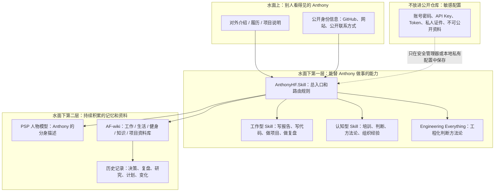

# AnthonyHF.Skill

这是 Anthony Fan 的个人数字分身入口。

它不是一个普通的代码仓库，也不是简历仓库。你可以把它理解成：一个 AI 想要“像 Anthony 一样做事”时，先从这里进门，再去读取不同层面的材料。

这个仓库主要回答三件事：

1. Anthony 是谁。
2. Anthony 的数字分身由哪些部分组成。
3. AI 或人应该怎么使用这些材料。

## Anthony 是谁

Anthony Fan 当前的核心身份是：一个把工作、知识、生活经验和工程判断沉淀成 AI 可调用系统的人。

更具体地说：

- 他关心的不只是“让 AI 回答问题”，而是让 AI 能继承一个人的上下文、判断方式和做事习惯。
- 他把自己的工作、生活、学习、健身、研究和项目经验，放进可以持续迭代的知识系统里。
- 他希望数字分身不是“模仿语气的聊天机器人”，而是能基于真实材料持续进化的个人操作系统。

## 这个仓库是什么

AnthonyHF.Skill 是一个总入口。

它本身不保存所有东西，而是负责告诉 AI：

- 哪些东西代表 Anthony 的身份。
- 哪些 Skill 能替 Anthony 做事。
- 哪些知识库记录了 Anthony 的工作和生活。
- 哪些内容可以公开，哪些内容绝不能放进公开仓库。

## 数字分身的冰山结构

普通人看到一个数字分身，可能只看到它“会说话、会写东西、会帮忙做事”。但真正让它长期有用的，是水面下的结构。



## 三个核心层面

### 1. Identity：身份层

身份层回答：“Anthony 到底是谁？”

这里包括三类东西：

- **客观身份配置**：公开账号、公开主页、常用名字、公开联系方式等。
- **分身描述**：`people/anthony-fan/PSP.md`，记录 Anthony 的判断方式、边界、当前身份切片和缺失素材。
- **对外履历与介绍**：用于让别人快速理解 Anthony 做过什么、擅长什么、正在构建什么。这类材料可以来自独立的自我审视 / 个人定位类 Skill，但不默认放进本仓库。

注意：账号密码、API Key、Token、私密身份材料不属于这个公开仓库。它们只能放在密码管理器、本地私有配置或专门的安全系统里。

### 2. Skills：能力层

能力层回答：“这个分身能做什么？”

Skill 可以粗略分成两类：

- **工作型 Skill**：替 Anthony 做具体事情，比如写报告、写代码、整理文档、做项目计划、复盘进展。
- **认知型 Skill**：承载 Anthony 的判断方式，比如工程化思维、培训方法、组织经验、项目治理和方法论沉淀。

当前已经接入的核心能力是：

- `skills/engineering-everything`：把问题按工程方式拆解，判断阶段、路径、边界和验证方式。

未来可以继续加入更多 Skill，但每个 Skill 都应该有清晰职责，不要把所有东西混成一个大杂烩。

### 3. AF-wiki：记忆层

记忆层回答：“这个分身靠什么持续进化？”

`knowledge/af-wiki` 是 Anthony 的可迭代资料库。它更像一个持续生长的个人第二大脑，里面可以承载：

- 工作上下文。
- 项目记录。
- 研究和学习材料。
- 健身、生活和习惯记录。
- 决策、复盘和历史变化。

如果说 Skill 是“能动手做事的能力”，那 AF-wiki 就是“让它知道 Anthony 过去经历了什么、现在在做什么、未来想往哪走”的记忆系统。

## 当前仓库结构

| 路径 | 普通人理解 | 作用 |
| --- | --- | --- |
| `SKILL.md` | 使用说明书 | 告诉 AI 什么时候使用 AnthonyHF，以及该读哪些材料。 |
| `people/anthony-fan/PSP.md` | 人物画像草稿 | 记录 Anthony 的分身描述，但目前还在搭框架阶段，不能当成完整真人复刻。 |
| `skills/engineering-everything` | 做事方法 | Anthony 的工程化判断和项目执行方法论。 |
| `knowledge/af-wiki` | 长期记忆库 | Anthony 的工作、生活、知识和项目资料。它是 Git 子仓库，独立维护。 |
| `matrix.yml` | 目录清单 | 用机器可读的方式列出当前组件。 |

## 使用方法

### 给普通读者

如果你只是想理解 AnthonyHF.Skill，按这个顺序看：

1. 先看本 README。
2. 再看 `SKILL.md`，理解 AI 如何使用这个仓库。
3. 想了解分身画像，看 `people/anthony-fan/PSP.md`。
4. 想了解长期资料，看 `knowledge/af-wiki/START-HERE.md`。

### 给 AI / 自动化助手

AI 或自动化助手使用时按这个顺序：

1. 读取 `SKILL.md`。
2. 判断用户问题属于身份、能力，还是记忆。
3. 身份问题读 `people/anthony-fan/PSP.md`。
4. 工程和项目问题读 `skills/engineering-everything/SKILL.md`。
5. 工作、生活、知识、健身、项目上下文读 `knowledge/af-wiki/START-HERE.md`。
6. 如果材料不足，必须明确说明“当前材料不足”，不要编造 Anthony 的经历或想法。

### 克隆仓库

```bash
git clone --recurse-submodules https://github.com/HaodiFan/AnthonyHF.Skill.git
```

已有本地仓库时，初始化 Git 子仓库：

```bash
git submodule update --init --recursive
```

## 公开边界

这个仓库现在是公开仓库，所以必须遵守以下规则：

- 不提交账号密码。
- 不提交 API Key、Token、cookie 或私钥。
- 不提交身份证件、私人聊天记录、合同、财务数据等敏感材料。
- 不把 AF-wiki 中不适合公开的内容复制到根仓库。
- PSP 只记录可以公开、可以验证、且有来源支撑的内容。

AnthonyHF.Skill 的目标不是把一个人的全部隐私公开，而是建立一个清晰、安全、可进化的数字分身入口。
